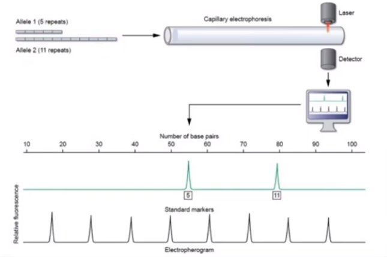
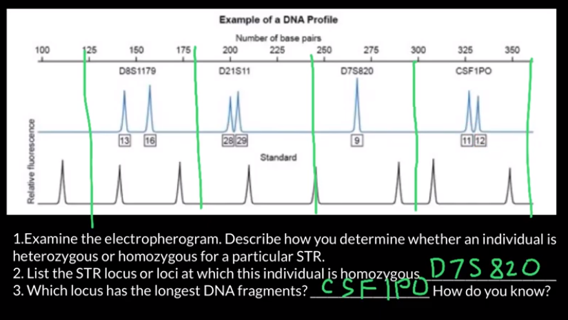
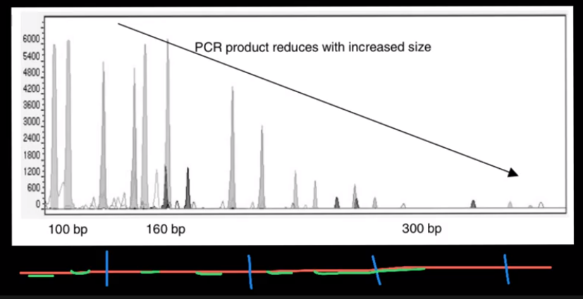
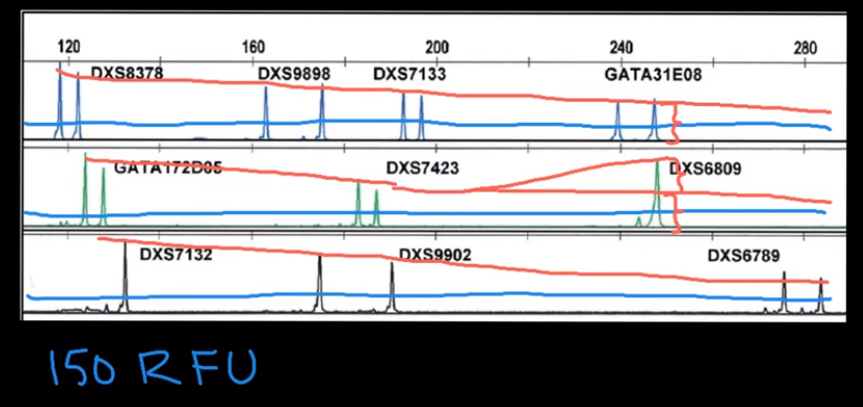

## Data notes
*Images taken from [Nikolay's Genetics Lessons](https://www.youtube.com/user/GeneticsLessons)*

**Short Tandem Repeats** are tracks of repeated short (2-6bp) DNA sequences. The analyzed loci are picked since they have high variability between individuals. They are defined by CODIS.

Data is organized by locus (place on DNA). For each locus, two numbers are noted; each number represents the number of repeats for that locus for each chromosome (one from each parent). Therefore, they each represent a certain allele for this locus.

>Looking at locus TH01, the sequence is AATG.  
If then the noted number is 3, the sequence found was   
AATGAATGAATG

**Electropherogram** measures the STRs.   
The reference peaks at the bottom are molecules with known sizes that were passed through the machine. Therefore we know the sizes of the alleles that are being analyzed afterwards. The peaks are formed by the thousands of molecules passed through the machine at the same time (in a clump). On the y-axis, the peaks are measured in Relative fluorescent units.

>Here we see that there are four peaks before allele 1, which have known sizes of 1-4 repeats. Therefore we know that allele 1 has more than 4 repeats. There are two known peaks after allele 1 (of size e.g. 7 and 9), but before allele 2. Therefore we know that allele 1 has less than 7 repeats, and allele 2 has more than 9. etc.

When one peak is much bigger than the others, it indicates a homozygous allele.  

Each locus has their own region in the electropherogram, according to the amount of base pairs. When the regions overlap, peaks are colored differently to indicate the loci.

>Even though the CSF1PO locus has two alleles with 11 and 12 repeats, so lower than e.g. the ones at D8S1179 with 13 and 16 repeats, each repeat must consist of more nucleotides, therefore making the longest DNA fragments.  

Each STR region is surrounded by flanking regions which are always the same size and the same nucleotides.

Longer alleles are more likely to be broken in the degradation/cutting process, therefore they have smaller peaks in the electropherogram.

>

Due to the measuring procedure of STR, artifacts can occur (e.g. smaller peak next to main peak), e.g. a nucleotide missing.
* Noise = smaller random peak, can be filtered by setting a threshold
* Stutter = small peak before or after the main peak, can be filtered by setting a threshold.
* Blobs = wider, higher peak that seem unrelated to alleles (e.g. there are already 2 alleles for one individual). Mainly related to errors of the physical measuring process.

Allelic drop out refers to a missing allele, which happens randomly when for instance the end of the flanking region is missing (mutated nucleotide at the end of the priming sequence), therefore the allele cannot be attached and the peak is missing.

>In this example, we can see that the inital peak for the DXS7132 locus is not quite high enough to account for a homozygous allele (it would have to be ~twice as high). Therefore, this must be allele drop out. The blue line is a 150RPU threshold to filter out stutter (noise).  

**PowerPlex Fusion 6C profiles** is the type of data that we have.
* 590 profiles
* 1-5 contributors
* 1174 different donors
